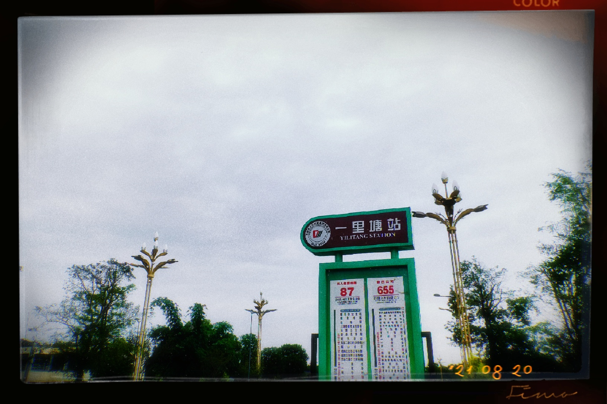
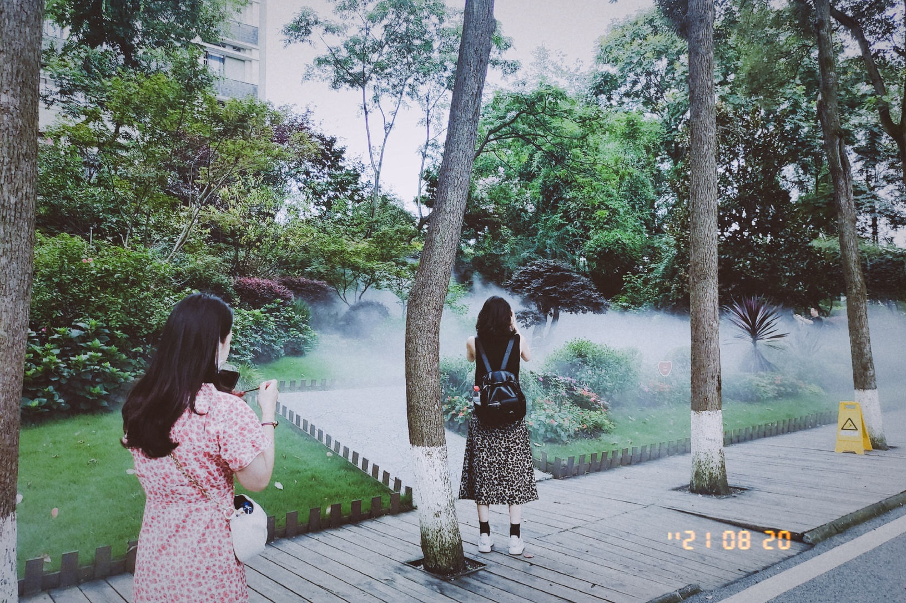
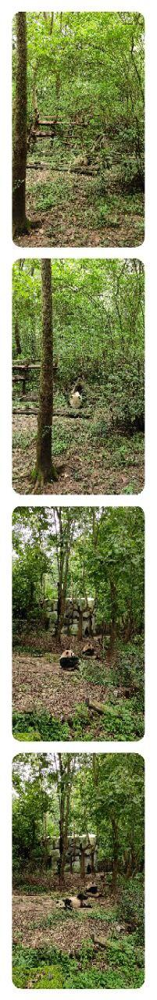

9：20出发，进入阳光甚好，美滋滋~

坐在公交车🚌上，看着内外的美女们，这才是生活该有的样子啊。

好吧，出师不利，上了反方向的车了😯。过了n久打开导航才发现。不过，这里好安逸啊，树木茂盛，绿意盎然。

下车，重新上车，出发！Go 👆

再次听到川师南大门的报站声🤣

转车，下了 k19，转655。今天阴天⛅，空气很凉爽。中午了，路边还有跳广场舞的大爷大妈。

然后做了短短的几站路，心情有点激动啊。到了！

不亏是熊猫基地附近，这里的每家店都带着满满的熊猫元素。不过人好少啊,是中午的原因吗。

满满的走到了基地门口，买票，扫码，测体温。离熊猫有近了一步哈哈。哪里的都有水雾装置，和夏天很搭配。

哇！看到熊猫了！！！ 好可爱。

还有更多！

哈哈哈哈，人少，不热，还能看到🐼，真是太好了。而且还有小熊猫。提问，小熊猫是熊猫吗？

一直看不到小熊猫 😩。

哇，总算看到了。一只趴在树上，一动不动。。。可惜拍不到。还有一只，太萌了。

好羡慕保安大叔啊，每天都能看到熊猫🐼，还有工资的生活只应天上有吧。

2：50 游玩结束。腿有点酸啊。

出去玩确实有点累啊，休息去了。拜拜~👋🏻
